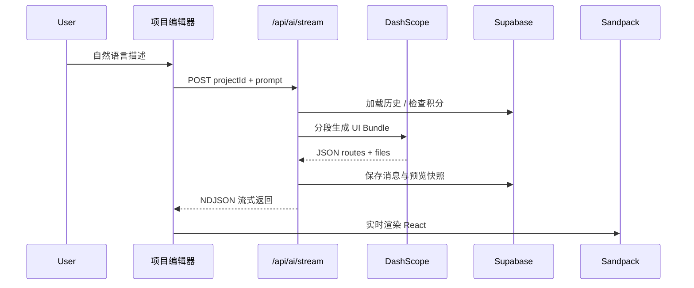

<div align="center">


# TensorView Builder

**用自然语言生成、预览并发布现代 React 网页应用**

*Describe your product in plain language → get a multi-page React app → preview live → ship.*

<br/>

[](./LICENSE)
[](https://github.com/qlghmz/ai-tensorview-cc/actions)
[](https://www.typescriptlang.org/)
[](https://react.dev/)
[](https://ai.tensorview.cc)

<br/>

[**🚀 在线体验**](https://ai.tensorview.cc) · [**📖 文档**](https://ai.tensorview.cc/docs) · [**🐛 反馈 Issue**](https://github.com/qlghmz/ai-tensorview-cc/issues) · [**⭐ Star**](https://github.com/qlghmz/ai-tensorview-cc)

</div>

<br/>

<p align="center">
  
</p>

<br/>

## ✨ 这是什么？

**TensorView Builder** 是一个开源的 **AI 建站 / UI 生成器**：

- 💬 **对话生成** — 中文描述产品，AI 输出多文件 React + TypeScript 项目  
- 👁️ **Sandpack 实时预览** — 浏览器内即时渲染，边聊边改  
- 🗄️ **Supabase 后端** — 用户、项目、积分、RLS 开箱即用  
- ☁️ **Cloudflare Workers 部署** — 自托管，支持 staging / production 隔离  
- 🚢 **一键发布** — EdgeOne、Vercel 或公开分享链接  

<p align="center">
  
</p>

---

## 🛠️ 技术栈

<p align="center">


</p>

| 层级 | 技术 |
|------|------|
| 前端框架 | [TanStack Start](https://tanstack.com/start) + React 19 |
| 预览引擎 | [Sandpack](https://sandpack.codesandbox.io/) |
| 数据库 / Auth | [Supabase](https://supabase.com) + Postgres RLS |
| 托管 | [Cloudflare Workers](https://workers.dev) + Nitro |
| AI（默认） | [DashScope 通义千问](https://help.aliyun.com/zh/dashscope/) |

---

## 🎯 功能亮点

| | |
|:---:|:---|
| 🧠 **分段生成** | 大站点拆页生成，控制 token、提升质量 |
| 📦 **UI Bundle** | 结构化 JSON（routes + files）→ Sandpack 文件系统 |
| 💳 **积分系统** | 每日补给 + 管理员豁免，可扩展付费 |
| 🔐 **多环境** | Local / Staging / Production 独立 Worker + 密钥 |
| 📤 **导出** | 下载 bundle、推送 GitHub、发布静态页 |
| 🌐 **i18n** | 中英文界面 |

---

## 🚀 快速开始

### 1. 克隆 & 安装

```bash
git clone https://github.com/qlghmz/ai-tensorview-cc.git
cd ai-tensorview-cc
npm install
```

### 2. 配置环境

```bash
cp .env.example .env.local
```

在 `.env.local` 中填入：

| 变量 | 说明 |
|------|------|
| `VITE_SUPABASE_*` | Supabase 项目 URL 与 anon key |
| `SUPABASE_SERVICE_ROLE_KEY` | 服务端 API 用（勿泄露） |
| `DASHSCOPE_API_KEY` | 通义千问 API Key |

### 3. 数据库迁移

```bash
npx supabase link --project-ref YOUR_REF
npx supabase db push
```

Dashboard → **Authentication → URL Configuration**：

- Site URL: `http://localhost:8080`  
- Redirect: `http://localhost:8080/**`

### 4. 启动

```bash
npm run dev
# → http://localhost:8080
```

---

## 🌍 环境 & 部署

<table>
<tr>
<th>环境</th>
<th>用途</th>
<th>配置文件</th>
<th>命令</th>
</tr>
<tr>
<td align="center">🖥️ <b>Local</b></td>
<td>日常开发</td>
<td><code>.env.local</code></td>
<td><code>npm run dev</code></td>
</tr>
<tr>
<td align="center">🧪 <b>Staging</b></td>
<td>上线前验证</td>
<td><code>.env.staging.local</code></td>
<td><code>npm run deploy:staging</code></td>
</tr>
<tr>
<td align="center">🟢 <b>Production</b></td>
<td>正式用户</td>
<td><code>.env.production.local</code></td>
<td><code>npm run deploy:production</code></td>
</tr>
</table>

```bash
cp .env.staging.example .env.staging.local
cp .env.production.example .env.production.local

npx wrangler login
npm run deploy:staging      # *.workers.dev 测试
npm run deploy:production   # 正式域名
```

📄 完整指南：[docs/DEPLOYMENT.md](./docs/DEPLOYMENT.md)

---

## 🔄 AI 生成流程



📄 深入阅读：[docs/GENERATION.md](./docs/GENERATION.md)

<details>
<summary><b>📁 核心源码入口</b></summary>

| 文件 | 作用 |
|------|------|
| `src/routes/project.$projectId.tsx` | 聊天 + 预览编辑器 |
| `src/routes/api.ai.stream.ts` | 流式生成 API |
| `src/lib/ai-generate-shared.ts` | Prompt / 解析 / 持久化 |
| `src/lib/ui-bundle.ts` | UI Bundle → Sandpack |
| `src/components/preview/SandpackPreview.tsx` | 浏览器内预览 |

</details>

---

## 📜 常用脚本

| 命令 | 说明 |
|------|------|
| `npm run dev` | 本地开发 |
| `npm run build` | 生产构建 |
| `npm run deploy:staging` | 部署测试 Worker |
| `npm run deploy:production` | 部署生产 Worker |
| `npm run smoke:staging` | Staging 冒烟测试 |
| `npm run smoke:production` | Production 冒烟测试 |
| `npm run bind:domain` | 绑定自定义域名 |

---

## 📂 项目结构

```
ai-tensorview-cc/
├── src/
│   ├── routes/          # 页面 & API 路由
│   ├── lib/               # AI、积分、Bundle 解析
│   └── components/        # UI + Sandpack 预览
├── supabase/migrations/   # 数据库 schema + RLS
├── scripts/               # 部署、测试、导入工具
├── docs/                  # 架构 & 部署文档
└── .github/assets/        # Logo & README 插图
```

---

## 🤝 参与贡献

欢迎 Issue 和 Pull Request！

1. Fork 本仓库  
2. 创建分支：`git checkout -b feat/your-feature`  
3. 提交改动并 push  
4. 打开 Pull Request  

合并后由维护者决定是否部署到 [ai.tensorview.cc](https://ai.tensorview.cc)。

---

## 📄 License

[MIT](./LICENSE) © TensorView

---

<div align="center">

**如果这个项目对你有帮助，欢迎点个 ⭐ Star**

<br/>

<a href="https://ai.tensorview.cc"></a>

</div>
