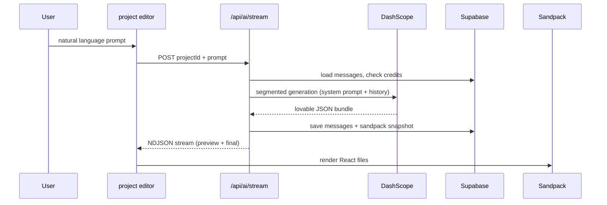

# TensorView Builder

Open-source **AI-powered React UI builder**: describe a product in natural language, get a multi-file React + TypeScript project, and preview it live in the browser with Sandpack.

Built with [TanStack Start](https://tanstack.com/start), [Supabase](https://supabase.com), and [Cloudflare Workers](https://workers.dev). AI generation uses [DashScope (通义千问)](https://help.aliyun.com/zh/dashscope/) by default.

## Features

- Natural-language → multi-page React app (routes, components, Tailwind styling)
- Live Sandpack preview with hot reload
- User auth, projects, credits, admin panel (Supabase + RLS)
- Optional publish to static hosting / Vercel / EdgeOne
- **Staging vs production** deploy paths so testing never hits live users

## Quick start (local dev)

```bash
git clone https://github.com/qlghmz/ai-tensorview-cc.git
cd ai-tensorview-cc
npm install

cp .env.example .env.local
# Fill Supabase + DASHSCOPE_API_KEY in .env.local

npx supabase link --project-ref YOUR_REF
npx supabase db push

npm run dev
# → http://localhost:8080
```

### Supabase setup

1. Create a project at [supabase.com](https://supabase.com).
2. Run migrations: `npx supabase link` then `npx supabase db push`.
3. In Dashboard → Authentication → URL Configuration, set Site URL to `http://localhost:8080` and add redirect `http://localhost:8080/**`.
4. Copy **anon** and **service_role** keys into `.env.local`.

### AI key

Set `DASHSCOPE_API_KEY` in `.env.local`. Optional: `DASHSCOPE_MODEL` (default `qwen-plus`).

## Environments

| Environment | Purpose | Config file | Deploy |
|-------------|---------|-------------|--------|
| **Local** | Development | `.env.local` | `npm run dev` |
| **Staging** | Pre-release testing | `.env.staging.local` | `npm run deploy:staging` |
| **Production** | Live users | `.env.production.local` | `npm run deploy:production` |

Staging deploys to a **separate Cloudflare Worker** (`*.workers.dev` by default). Production uses your custom domain.

See [docs/DEPLOYMENT.md](./docs/DEPLOYMENT.md) for the full workflow.

```bash
cp .env.staging.example .env.staging.local      # staging secrets
cp .env.production.example .env.production.local  # production secrets

npm run deploy:staging      # test on workers.dev
npm run smoke:staging

npm run deploy:production   # live site
npm run smoke:production
```

**Tip:** Supabase free tier allows 2 active projects. For staging DB, use `supabase start` locally, pause an unused project, or upgrade.

## How AI UI generation works

High-level flow:



Details: [docs/GENERATION.md](./docs/GENERATION.md)

Key source files:

| File | Role |
|------|------|
| `src/routes/project.$projectId.tsx` | Chat UI + preview panel |
| `src/routes/api.ai.stream.ts` | Streaming generation API |
| `src/lib/ai-generate-shared.ts` | Prompts, parsing, persistence |
| `src/lib/lovable-bundle.ts` | Lovable JSON → Sandpack files |
| `src/components/lovable/LovableSandpack.tsx` | In-browser preview |

## Deploy to Cloudflare

```bash
npx wrangler login
cp .env.production.example .env.production.local
# fill secrets

npm run deploy:production
```

Custom domain (optional): set `CUSTOM_DOMAIN` and `CLOUDFLARE_ZONE_ID`, save DNS token to `.cloudflare-dns-token`, then `npm run bind:domain`.

## Scripts

| Script | Description |
|--------|-------------|
| `npm run dev` | Local dev server |
| `npm run build` | Production build |
| `npm run deploy:staging` | Deploy staging worker |
| `npm run deploy:production` | Deploy production worker |
| `npm run smoke:staging` | HTTP + auth smoke test (staging) |
| `npm run smoke:production` | Smoke test (production) |
| `npm run bind:domain` | DNS cleanup + custom domain bind |
| `npm run import:all` | CSV migration helper (optional) |

## Project structure

```
src/
  routes/           # TanStack Router pages + API routes
  lib/              # AI, credits, bundle parsing
  components/       # UI + Sandpack wrapper
supabase/
  migrations/       # Postgres schema + RLS
scripts/            # Deploy, smoke test, import tools
docs/               # Architecture & deployment guides
```

## License

[MIT](./LICENSE)

## Acknowledgments

Originally scaffolded with [Lovable](https://lovable.dev); migrated to self-hosted Supabase + Cloudflare Workers.
